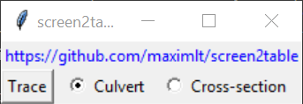
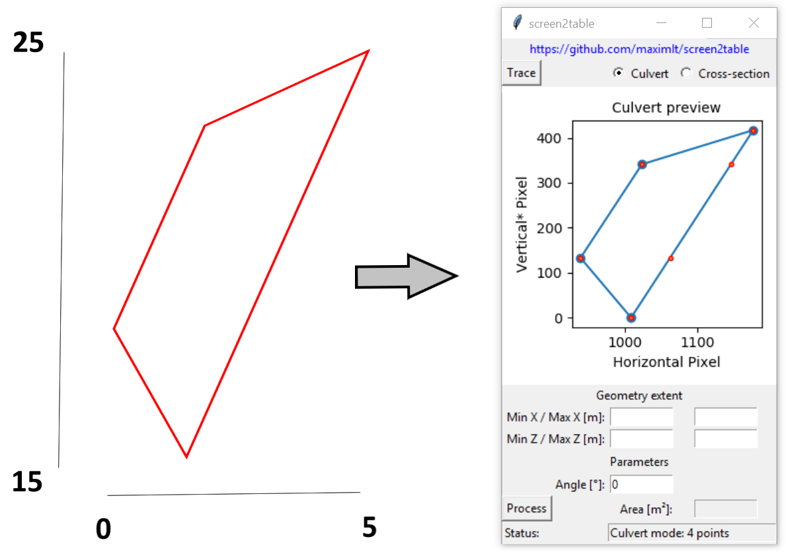
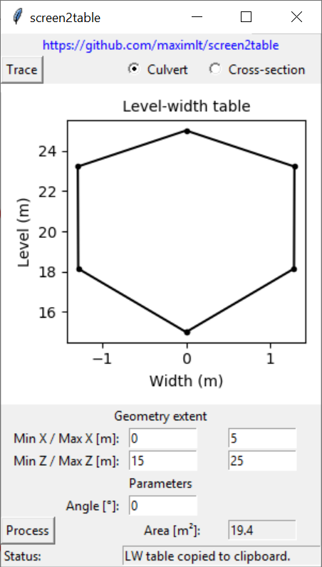
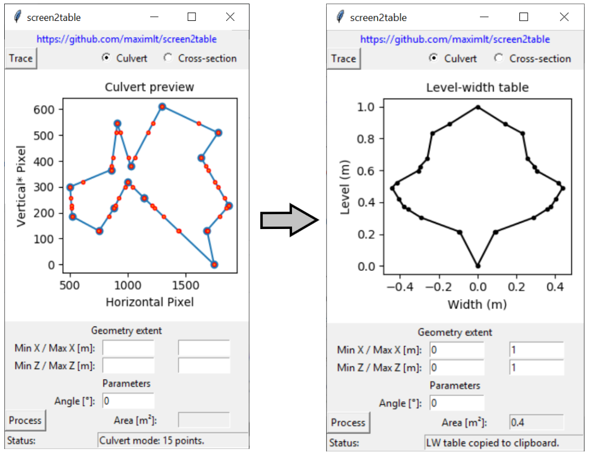

# screen2table

**screen2table** is a simple Python GUI app to generate geometric data table (coordinates or level-width) by tracing shapes displayed on the screen.

As the app was originally intended to make the development of hydraulic/hydrodynamic models easier, its input choice (cross-section or culvert) and its output (table copied to clipboard, tab-separated) are tailored to this use case. However, the app may prove to be useful in other situations, such as when one needs to determine the area of a complex polygon saved in a PDF file and whose extent is known. Then, by tracing the polygon on the screen, its shape can be drawn which allow the app to calculate its approximate area.

## Rationale

Hydraulic/hydrodynamic models (1D, 2D or 1D/2D) require as input data some geometric description of a river, its in-line structures and the structures lying in the floodplain. A river geometry is usually given as a series of cross-sections (i.e. level of the ground on a line perpendicular to the flow path). The geometry of a structure like a culvert or an arch is often described by a level (or height)-width curve.

Modern softwares provide modelers with methods allowing to import geometric data in a breeze, but only if the input data is given in the right format (GIS format in most cases). However, the data may just be available as drawings saved in a bunch of PDF or CAD files. Modellers have then to resort to more manual, time-consuming, and tedious methods to generate relevant data table for developing their model.

**screen2table** aims to fill this gap by providing a fast and easy way to retrieve that geometric data.

## Quick user guide

<p align="center"></p>

First, the user should select between the *culvert* or *cross-section* mode, which have the following outputs:

#### *Culvert* (closed chape):
- Area in square meter (displayed with 2 decimals)
- Level-Width table in meter (copied to clipboard with 4 decimals, tab-separated) that starts and end with a width of zero
- Plot of the level-width table (in a rather unusual format, as in Mike Hydro)
#### *Cross-section* (open shape):
- Length in meter (displayed with 2 decimals)
- X/Z coordinates table in meter (copied to clipboard with 4 decimals, tab-separated)
- Plot of the scaled cross-section

The user is then required to perform the two following steps:
1. *Tracing*: The drawing from which the geometry should be copied is traced by ***left-clicking*** on its outline. Tracing is stopped with a ***right-click*** anywhere on the screen (that ***does not add*** a new point). The more zoomed in the drawing on the screen, the closer to the outline the clicks, and the higher the number of points, the more accurate the geometry. Because the app records screen coordinates only, ***the drawing should not be modified (panned, zoomed in/out) on the screen while tracing it.*** The traced geometry is displayed in the app for visual inspection after the right-click, new entry boxes are now available for the following step.

<p align="center"></p>

2. *Scaling and processing*: The user provides the geometry extent of the drawing (its bounding box, in meter preferably) which is used by the app to scale the recorded geometry to its real dimension and process it further. Optionnaly, an angle in degree can be provided to skew the geometry before processing it. This is for instance useful to horizontally flip a line (angle of 180°).

<p align="center"></p>

## Technical note

While generating the output for the cross-section mode is straightforward, ***some more work is done by the app when it processes culvert data***: 
1. Aditional interpolated points are added to the geometry at the clicked levels (vertical screen coordinates), this is required because the width will be calculated at each clicked point. Those points are indicated in red on the culvert plot after tracing.
2. If two or more points were clicked on the exact same level (in practice, it means two or more clicks hit the exact same pixel row), the question arises as to which width should be attributed to this level (the smallest? the largest?). The trick used to make the width computation easier is to transform those points so that there are two and only two points at the same level within a polygon. This is done by adding/subtracting small random numbers to those points. While this may look like a numerical trick only, this is actually realistic: down to a given scale there are never two measurements found at the same level (this is continuous data).
3. The width is calculated at each of those clicked/derived levels (there is no regular vertical discretization), be the polygon concave or convex (it cannot be self-intersecting though).
4. Rows in the level-width table that are almost identical, defined as an absolute change in both width and level less than 1e-4 meter, are considered as duplicates. Only the first one is preserved (why? because Mike Hydro was not very happy with too close points in the level-width data).

<p align="center"></p>

# Install

**screen2table** targets ***Windows only*** (the clipboard is OS specific) and is developed based on ***Python 3.7***. The package can be *pip* installed via Github as follows:

```
pip install https://github.com/maximlt/screen2table/master
```
It can then be launched from the command line since an entry point in created during the install.

To go a little further, there are tools that can turn a package into a binary file (an .exe on Windows), that is then easy to distribute. *Pyinstaller*, among others, can do that pretty well:
```
pyinstaller --onefile --windowed screen2table/screen2table.py 
```
The above line will create a *dist* folder containing a single executable file, *screen2table.exe*, which includes Python, the app and its dependencies.

# Dependencies

**screen2table** relies on the following Python packages:
- [pynput](https://pynput.readthedocs.io/en/latest/) to record the pixel coordinates of the clicks
- [Numpy](https://www.numpy.org/) to derive the metrics and the level-width curve
- [Matplotlib](https://matplotlib.org/) to plot the results obviously, but also to support processing complex polygons
- [pywin32](https://github.com/mhammond/pywin32) to copy the output table to clipboard

# Coding note

**screen2table** was also a learning project, hence the non-pythonic pieces of code and some poor design decisions.

# License

MIT License

Copyright (c) 2019 Maxime Liquet

Permission is hereby granted, free of charge, to any person obtaining a copy
of this software and associated documentation files (the "Software"), to deal
in the Software without restriction, including without limitation the rights
to use, copy, modify, merge, publish, distribute, sublicense, and/or sell
copies of the Software, and to permit persons to whom the Software is
furnished to do so, subject to the following conditions:

The above copyright notice and this permission notice shall be included in all
copies or substantial portions of the Software.

THE SOFTWARE IS PROVIDED "AS IS", WITHOUT WARRANTY OF ANY KIND, EXPRESS OR
IMPLIED, INCLUDING BUT NOT LIMITED TO THE WARRANTIES OF MERCHANTABILITY,
FITNESS FOR A PARTICULAR PURPOSE AND NONINFRINGEMENT. IN NO EVENT SHALL THE
AUTHORS OR COPYRIGHT HOLDERS BE LIABLE FOR ANY CLAIM, DAMAGES OR OTHER
LIABILITY, WHETHER IN AN ACTION OF CONTRACT, TORT OR OTHERWISE, ARISING FROM,
OUT OF OR IN CONNECTION WITH THE SOFTWARE OR THE USE OR OTHER DEALINGS IN THE
SOFTWARE.